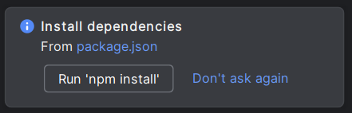
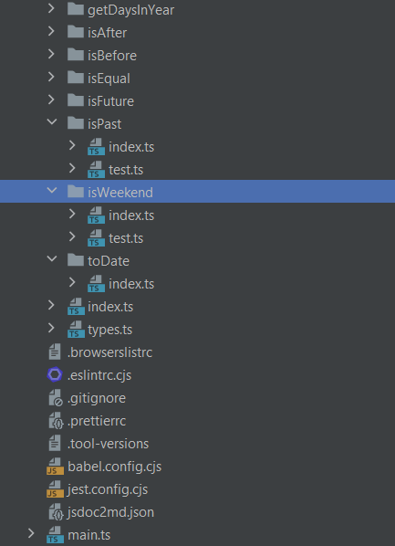

# Install the environment

## Execution Policy (Windows Users)
Before starting you need to check your Privacy Policy settings
To check your execution policy open a Powershell with the root privileges and launch the command:
`Get-ExecutionPolicy`
Make sure your policy is set to `RemoteSigned`
If not, you can set them with the command: `Set-ExecutionPolicy -ExecutionPolicy RemoteSigned`

## Download the plugin archive

- Open the link you received via mail
- Download the Plugin archive file and extract the archive with the password provided in the classroom
- **Open your IntelliJ Idea IDE**

## Open Plugin settings

- Press `Ctrl + Alt + S` in Windows machines or `Command + ','` in Mac OS - to open the IDE setings and select **Plugins**. (You can also click on File -> Settings)

- Click ok Plugins tab
- Click on the ⚙️ button in the right part of the screen
- Click on 'Install Plugin from Disk...'
  
-  **Select the plugin archive file you just downloaded and click  OK**.
- Click  OK  to apply the changes and restart the IDE if prompted.
## Check your Dependency
- Check your node version

> `node -v`

Should return a number >= 14

## Open the provided project
- Open the project with IntelliJ Idea and wait for the automatic setup to be completed
- Click on the button that should be prompted out with `npm install` or just run `npm install` in the terminal to install all the dependency
  

## Check the PDF file you extracted
You could be asked to perform some special instructions, please check them in the pdf file contained in the archive you previously unzipped.

## Implement the required functions
In your source folder you will find several folders, each of them represents a function to be implemented.
If you open the corresponding **index.ts** file you will find the requirements with an example.

You can create a test file called **test.ts** in the same directory to verify the correctness of the implementation using jest, you can also use the **main.ts** file to call your functions and manually verify the correctness.

1. You can run your test configuration opening the **package.json** file and running the *test* or *test:coverage* script (pressing the  ▷ button next to the configuration) to run the complete test suite.
2. You can run a single test case, or a single test suite directly opening the target **test.ts** file and pressing the  ▷ button next to the test you want to run
3. You can run the **main.ts** file by pressing the  ▷ button next to the "start" configuration in the **package.json** file.

## Javascript Date Documentation

In the project structure, in the 'documentation' folder you can find the offline version of the Mozilla documentation regarding Javascript native available functions. You can use all the date functions to implement your code
